# How To Audit Smart Contracts

There are many ways to audit smart contract solidity, below I will list some of the audit tools/ways that I usually do it

- [RemixIDE](https://remix.ethereum.org/)
- [Ganache](https://www.npmjs.com/package/ganache-cli)
- [Slither](https://github.com/crytic/slither)
- [Infura](https://infura.io/)
- [Quicknode](https://www.quicknode.com/chains/bsc)
- [Ankr](https://docs.ankr.com/ankr-protocol/public-rpcs)
- [Moralis](https://moralis.io/)

## I. Testing Smart Contracts

Hiện tại để chạy một contract, chúng ta thường triển khai trên các mạng sau

### 1. Local Enviroment

We can use TestRPC, Ganache CLI uses ethereumjs to simulate full client behavior. We can setup time mining faster or slower. Here we will have 10 address to use in this testRPC

<h2 align="center">
  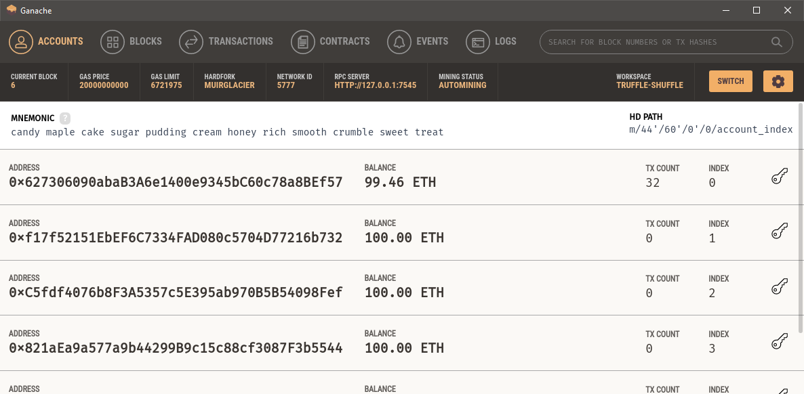
</h2>

### 2. Testnet blockchain

Nếu không muốn sử dụng ganache, thay vì đó muốn dùng testnet như một blockchain thật. Chúng ta có thể sử dụng Rinkeby hoặc Rospten của ethereum, hay bên Binance Smart Chain có bsctesnet

Để connect các mạng testnet này khá đơn giản, hiện tại có 2 thư viện phổ biến nhất cho developer là [web3](https://github.com/ChainSafe/web3.js) và [etherjs](https://github.com/ethers-io/ethers.js).
Trong docx đều có hướng dẫn cụ thế connect tới các mạng RPC như thế nào

### 3. Mainnet blockchain

## II. Audit Smart Contracts

Mình hay dùng [Slither](https://github.com/crytic/slither), nó sẽ báo những lỗi trong contract mình, thậm trí cả phí gas nếu cao.

```
$ slither .
```

<h2 align="center">
  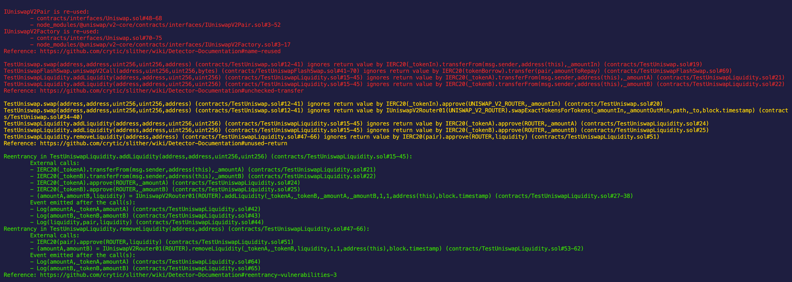
</h2>

## III. Fork Mainnet to test contract

Phần này mình khá hay dùng vì tiện cho việc test khi cần có nhiều dữ liệu thực nhanh chóng. Đơn giản khi có những lỗi xảy ra trên contract khiến cho user mất tiền hay mất nft hoặc mình muốn tối ưu gas khi dữ liệu bị nhiều lên.

Để fork từ mainnet về thì hiện tại mình dùng [Ganache](https://www.npmjs.com/package/ganache-cli) và lấy dữ liệu từ một blockchain cụ thể có cung cấp RPC
Hiện tại có rất nhiều các bên cung cấp rpc cho các blockchain khác nhau

### 1. [Moralis](https://moralis.io/)

<h2 align="center">
  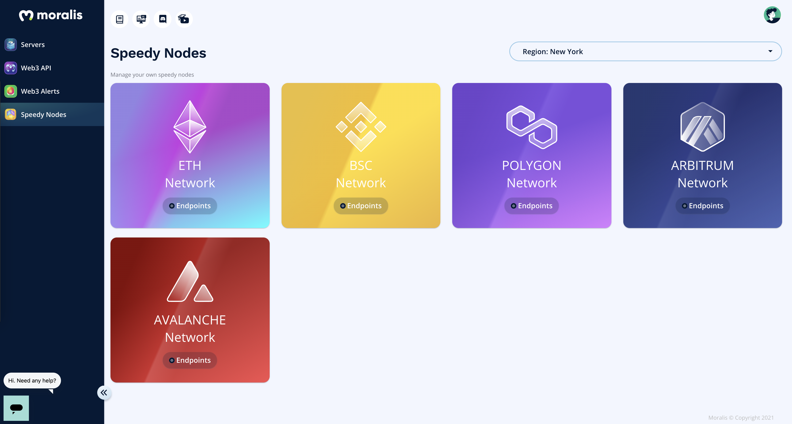
</h2>
<h2 align="center">
  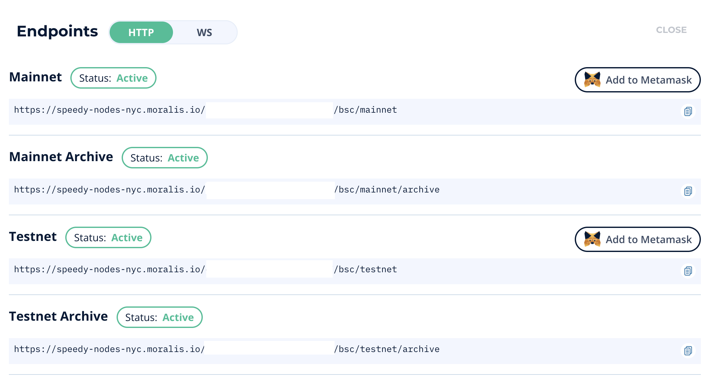
</h2>

### 2. [Quicknode](https://www.quicknode.com/chains/bsc)

<h2 align="center">
  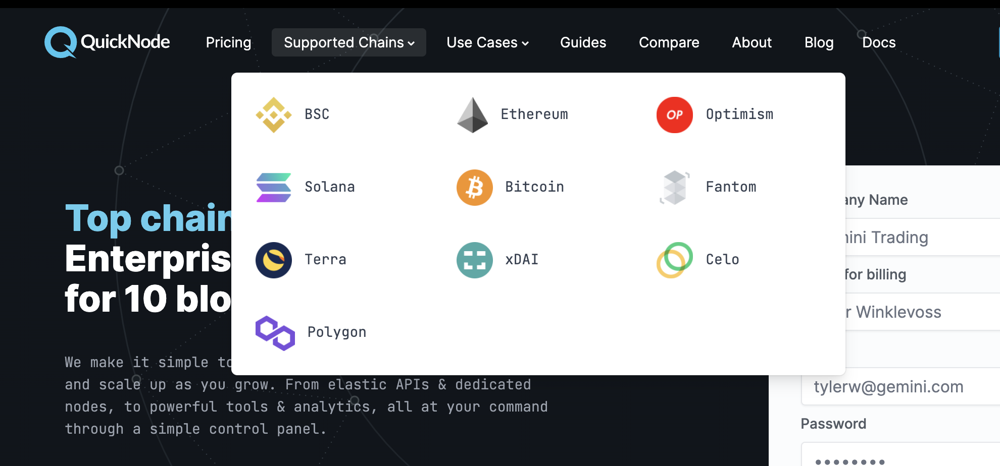
</h2>

### 3. [Ankr](https://docs.ankr.com/ankr-protocol/public-rpcs)

<h2 align="center">
  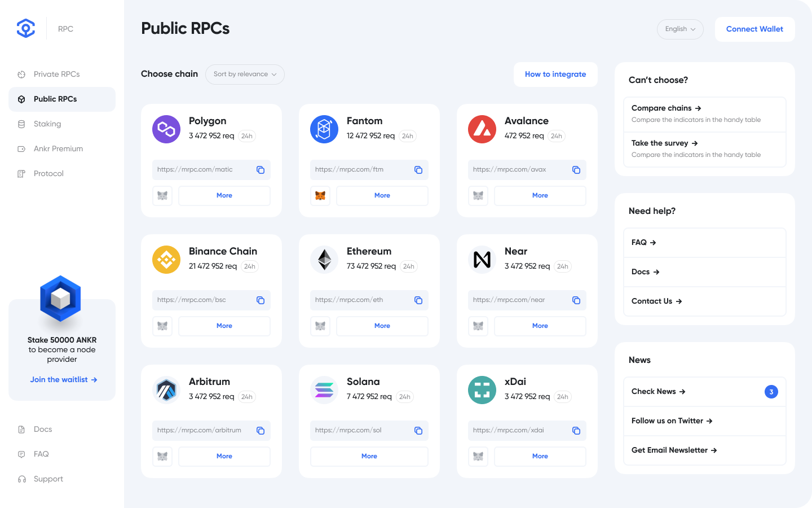
</h2>

### 4. [Infura](https://infura.io/)

## IV. Demo

### 1. Install ganache-cli

Mình sẽ sử dụng node archive lấy dữ liệu từ mạng eth mainnet

```
$ npm -i ganache-cli -g
$ ganache-cli --fork <Node_RPC> --unlock <Wallet> --networkId <chainID>

i.e. $ ganache-cli \
--fork https://speedy-nodes-nyc.moralis.io/<id>/bsc/mainnet/archive \
--unlock 0xb31e82ff4a6e593018fcd2f0784fb2162ed0a3a3 \
--unlock 0xb9b9926dfb2c021fcd8f2366961186a2760716e3 \
--unlock 0x6e12f983fc1ef11cd77273f19ff8e747458588b7 \
--networkId 56
```

Ngoài việc chọn node, chúng ta cần unlock những ví mà mình cần test. Ví đó sẽ thành của mình và chạy như mình là chủ ví. Trong Ganache có hỗ trợ chọn blockNumber cụ thể

<h2 align="center">
  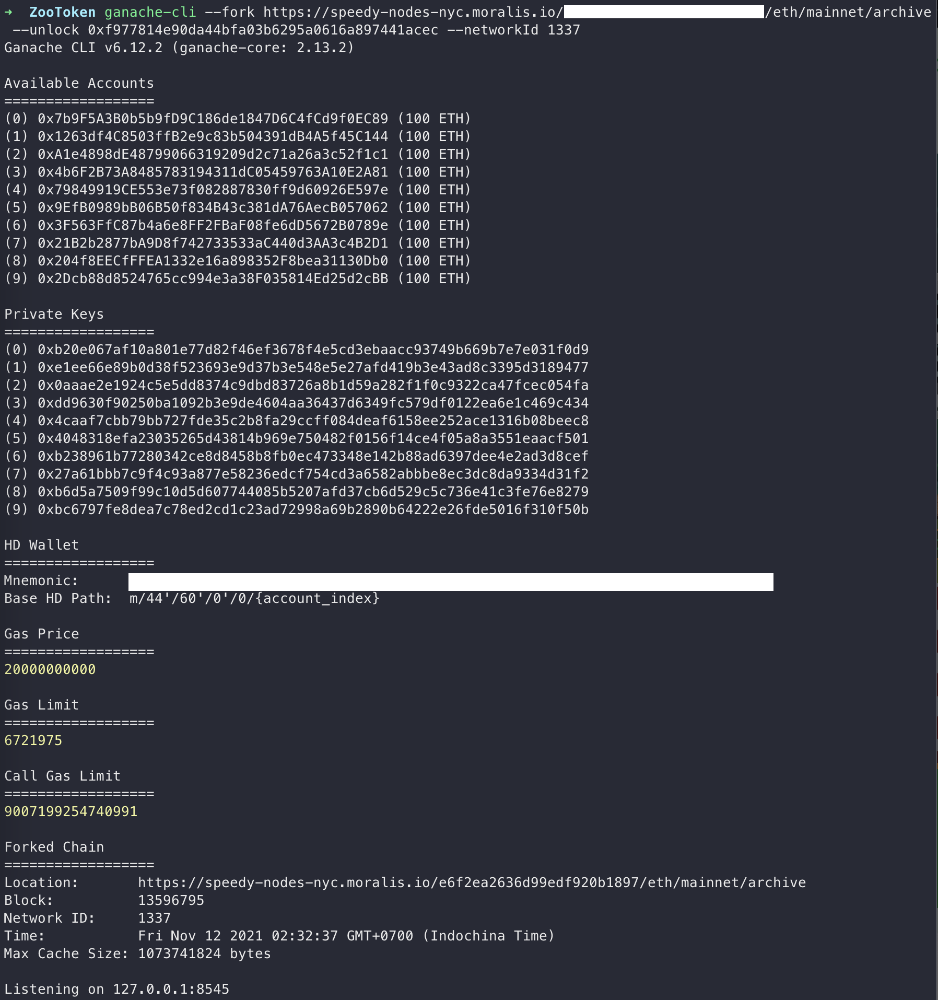
</h2>

### 2. Install [Hardhat](https://hardhat.org/getting-started/)

```
$ npm install --save-dev hardhat
$ npx hardhat
```

### 3. Test Transfer ERC20

Dưới đây, chúng tôi sẽ test thử với một token SHIBA bất kì trên mạng ETH mainnet mà theo chuẩn erc20. Chúng tôi chuyển tiền từ một whale holder vào ví chính mình.

```
$ npx hardhat --network localhost test test/testUniswap/test-erc20.js
```

<h2 align="center">
  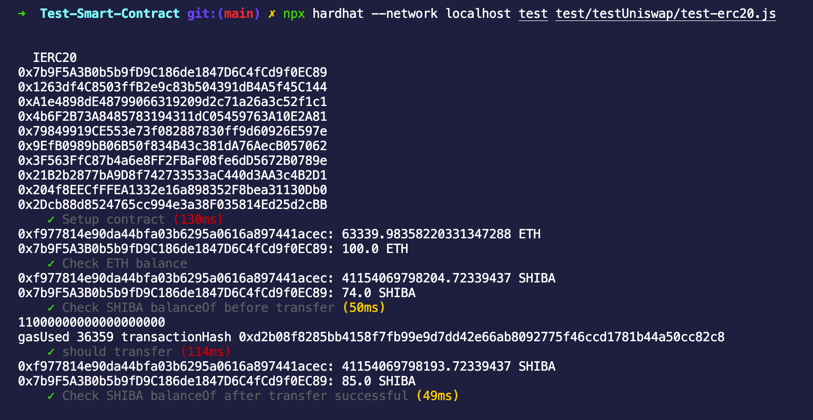
</h2>

With BSC

```
$ npx hardhat --network localhost test test/testBSC/test-bep20.js
```

<h2 align="center">
  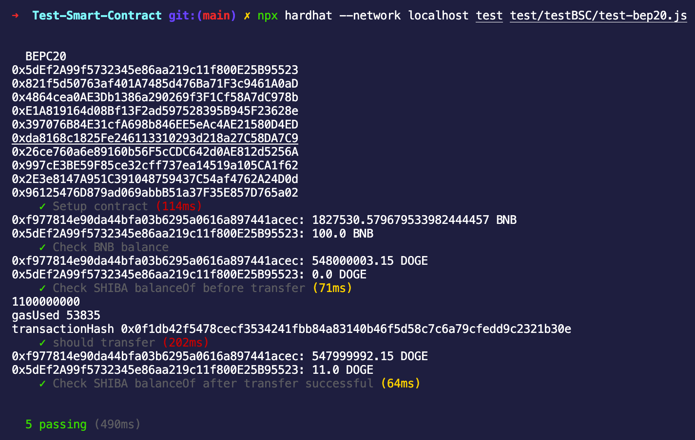
</h2>

### 4. Test ERC721

Test ví whale [0x6e12f983FC1eF11Cd77273f19ff8e747458588b7](https://bscscan.com/token/0xa7a9a8156c24c4b0ca910c3ba842d1f1ac7200ef?a=0x6e12f983fc1ef11cd77273f19ff8e747458588b7)

```
$ npx hardhat --network localhost test test/testBSC/test-bep721.js
```

<h2 align="center">
  
</h2>

### 5. Test Uniswap

```
$ npx hardhat --network localhost test test/testUniswap/test-uniswap.js
```

<h2 align="center">
  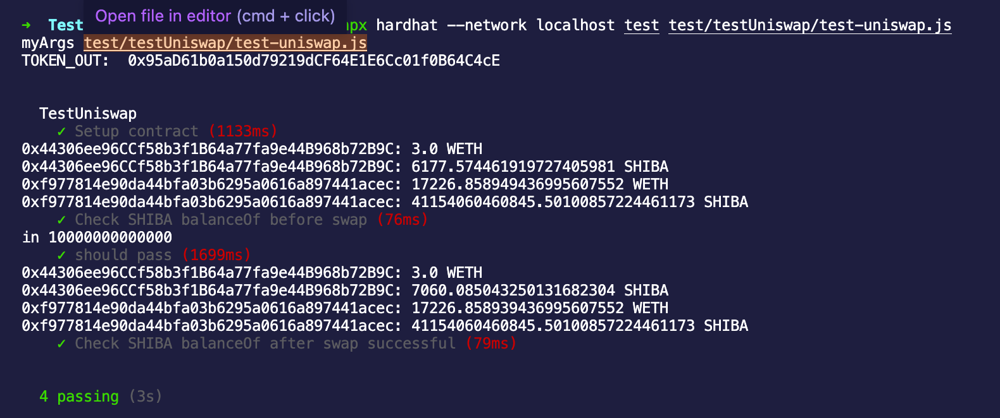
</h2>

### 6. Test Uniswap Liquidity

```
$ npx hardhat --network localhost test test/testUniswap/test-uniswap-liquidity.js
```

<h2 align="center">
  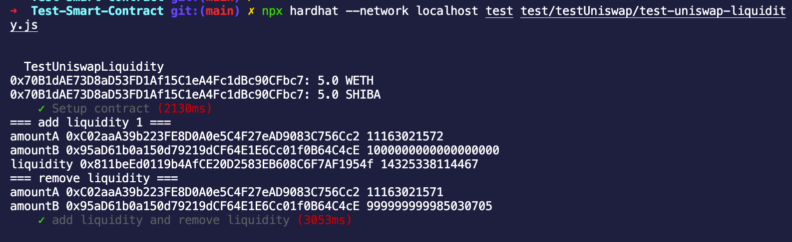
</h2>

### 7. Test Uniswap Liquidity vs uniswap

```
$ npx hardhat --network localhost test test/testUniswap/test-uniswap-LP-swap.js
```

<h2 align="center">
  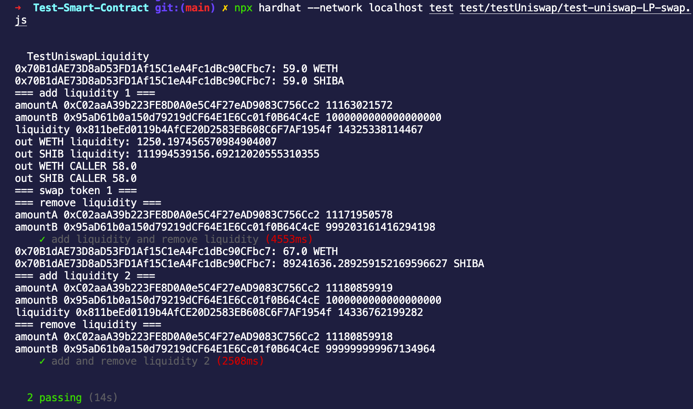
</h2>
